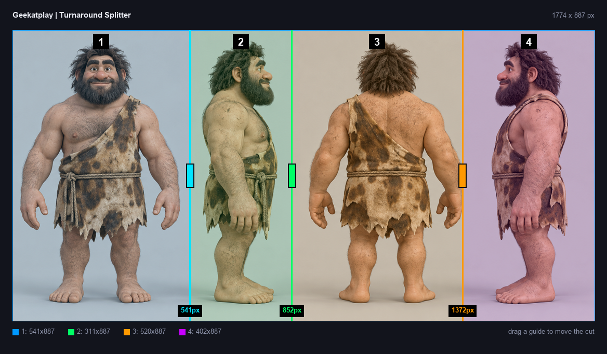
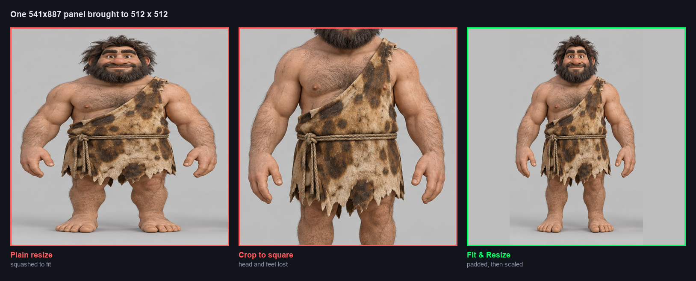
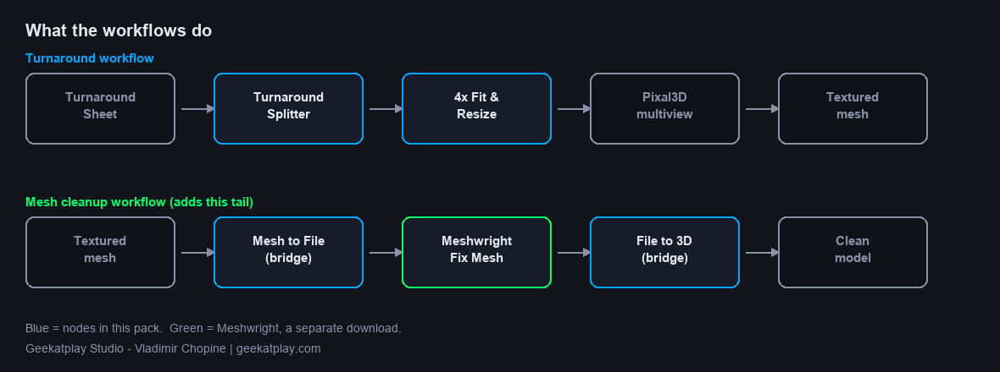

# ComfyUI 3D Turnaround Splitter

**Geekatplay Studio — Vladimir Chopine** · [geekatplay.com](https://www.geekatplay.com)

Turn a single character turnaround sheet into a finished, clean 3D model.



Most multiview 3D workflows want four separate images and expect you to crop
them by hand, typing pixel offsets into four crop nodes and re-typing all of
them the moment you load a different sheet. This pack replaces that with one
node you drag three lines across, and a resize node that refuses to distort your
character.

---

## Contents

- [Install](#install)
- [Turnaround Splitter](#turnaround-splitter)
- [Fit & Resize](#fit--resize)
- [Workflows](#workflows)
- [Mesh cleanup with Meshwright](#mesh-cleanup-with-meshwright)
- [Node reference](#node-reference)
- [Development](#development)

---

## Install

```
cd ComfyUI/custom_nodes
git clone https://github.com/GeekatplayStudio/ComfyUI-3d-turnaround-splitter.git
```

Restart ComfyUI. Nothing else to install — the nodes use `torch`, `numpy` and
`Pillow`, which ComfyUI already ships.

The demo turnaround sheet is copied into your `ComfyUI/input` folder on first
start, so the bundled workflows run immediately without hunting for an image.

Everything appears under **Geekatplay Studio → 3D Multiview** in the node menu.

---

## Turnaround Splitter

Loads one turnaround sheet and cuts it into four view images.

The sheet is drawn inside the node with three coloured guides over it. Drag a
guide left or right to move a cut. The four panels are tinted and numbered, and
each guide shows its position in pixels, so you can see exactly what each output
will contain before running anything.

Guides are stored as **fractions of the sheet width**, not pixel offsets. Swap in
a sheet of a different size and the cuts stay where they look right instead of
landing off the edge of the image.

| Widget | Meaning |
| --- | --- |
| `image` | The turnaround sheet, picked or uploaded like any other image input. |
| `guide_1` `guide_2` `guide_3` | Cut positions, `0.0`–`1.0` across the sheet. Set by dragging, or typed for an exact value. |

**Outputs** — for each of the four views, the image and its measured size:

```
image_1  width_1  height_1
image_2  width_2  height_2
image_3  width_3  height_3
image_4  width_4  height_4
```

The panels of a real sheet are rarely the same width. In the demo sheet above
they come out `541`, `311`, `520` and `402` pixels wide — which is why each view
reports its own dimensions rather than assuming a quarter each.

Guides are sorted before the cut, so they can be dragged past one another without
scrambling the output order, and every slice is kept at least one pixel wide.

**Buttons**

- **Even quarters** — snaps the guides back to 25% / 50% / 75%.
- **Reload** — re-reads the sheet from the input folder, for when the file has
  been replaced on disk.

---

## Fit & Resize

Brings an image to an exact output size **without stretching or cropping it**.



A turnaround panel is a tall, narrow strip. Resizing one straight to 512×512
squashes the character; cropping it to a square throws away the head and the
feet. This node does neither:

1. **Extend** the canvas with background-coloured margin until the image matches
   the requested proportions.
2. **Scale** the whole padded canvas down to the exact output size.

A `1024 × 400` strip headed for `512 × 512` first becomes `1024 × 1024`, then
scales to `512 × 512`. The subject keeps its shape and nothing is cut off.

| Widget | Meaning |
| --- | --- |
| `width` `height` | Exact size of the image leaving the node. |
| `background_source` | `auto (sample edges)` reads the margin colour from the image borders; `custom color` uses the field below. |
| `background_color` | Hex colour for the margin, e.g. `#000000`. Used only in `custom color` mode. |
| `alignment` | Where the original sits once the canvas grows — `center`, or pushed to one side (`start` / `end`). |
| `resize_method` | `lanczos`, `bicubic`, `bilinear`, `area` or `nearest-exact`. |

**Outputs:** `image`, plus the `width` and `height` it was rendered at.

`auto` takes the **median** colour of the four borders rather than the average,
so a subject running up against one edge barely tints the margin.

---

## Workflows



Two ready-to-run graphs in [`workflows/`](workflows/):

### `3d_geekatplay_turnaround_multiview.json`

The stock ComfyUI Pixal3D multiview graph with its front end replaced — the
image loader and four crop nodes become one Turnaround Splitter feeding four
Fit & Resize nodes. Everything downstream (background removal, conditioning,
sampling, mesh generation, texture baking) is untouched.

Load it, pick your sheet in the splitter, drag the guides into the gaps between
the views, and run. It opens on the bundled demo sheet with the guides already
placed.

The four outputs map to views in left-to-right sheet order:

| Output | View |
| --- | --- |
| `image_1` | front |
| `image_2` | left |
| `image_3` | back |
| `image_4` | right |

If your sheet is in a different order, rewire the four Fit & Resize nodes to
match — the splitter itself does not care what is on each panel.

### `3d_geekatplay_turnaround_meshwright.json`

The same graph plus a mesh cleanup stage on the end, described below.

---

## Mesh cleanup with Meshwright

A mesh straight out of a generative 3D model is rarely watertight. **Meshwright**
is Geekatplay Studio's desktop tool for exactly that problem — it diagnoses a
mesh, repairs holes, flipped normals and non-manifold edges, and scores how
ready the result is to print.

**Download: <https://github.com/GeekatplayStudio/Meshwright>**

Install it, then run its `scripts/install_comfyui_nodes.py` to add the Meshwright
nodes to ComfyUI. The cleanup workflow uses them for the repair itself and the
before/after comparison.

### Why this pack ships a bridge

ComfyUI's mesh sockets and Meshwright's mesh sockets are **both named `MESH`**,
so the editor is perfectly happy to let you draw a link straight between them.
They do not carry the same thing. ComfyUI passes batched torch tensors;
Meshwright expects a `trimesh` object. Wired directly, the graph looks correct
and then fails the moment you press Run:

```
TypeError: Unsupported 3D mesh data type:
           <class 'comfy_api.latest._util.geometry_types.MESH'>
```

The two bridge nodes route around this through a file on disk, which both sides
already understand — and which the desktop app can open as well:

```
ComfyUI mesh  ->  Mesh to File (Meshwright bridge)  ->  Meshwright Load 3D Model
                                    ...repair, reduce, compare...
Meshwright Save 3D Mesh  ->  File to 3D Model (bridge)  ->  Preview 3D / Save 3D
```

### Opening a result in the desktop app

**Open in Meshwright** shows where the cleaned model was written and offers to
reveal it on disk or start the app. It finds Meshwright through the
`MESHWRIGHT_HOME` environment variable, the config its ComfyUI installer writes,
or a folder you type into the node.

Meshwright opens on an empty viewport — it takes no file argument — so the node
shows the full path and gives you a one-click copy for it.

### Two things worth knowing before you run it

**Reduce Mesh ships bypassed.** Repair alone gives the best-looking result;
decimation is there for when you want a lighter mesh for a game engine. Enable
it with right-click → Mode → Always.

**Reduction needs an extra library.** Meshwright's heavy engines live in its own
virtual environment, and ComfyUI cannot borrow them — the two run different
Python versions, so the compiled modules will not load across. Without
`fast_simplification` in ComfyUI's own Python, Reduce Mesh returns the mesh
untouched and reports `0%` **without raising an error**. Install it where
ComfyUI can see it:

```
python_embeded\python.exe -m pip install fast_simplification pymeshfix
```

Repair itself works without them, falling back to Meshwright's own cleanup
routines.

---

## Node reference

| Node | In | Out |
| --- | --- | --- |
| **Turnaround Splitter** | a turnaround sheet | 4 × (image, width, height) |
| **Fit & Resize** | image | image, width, height |
| **Mesh to File** (bridge) | ComfyUI mesh | path to a GLB |
| **File to 3D Model** (bridge) | path | 3D model socket |
| **Open in Meshwright** | path | path, plus the buttons |

---

## Development

The workflows and the figures in this README are generated, not hand-edited, so
they cannot drift away from the code:

```
python tools/build_workflow.py            # the turnaround workflow
python tools/build_meshwright_workflow.py # ...plus the cleanup stage
python tools/build_docs_images.py         # the figures above
```

`3d_pixal3d_multi_views.json` is the stock ComfyUI template these are derived
from. When it moves on upstream, drop in the new copy and re-run the builders.

The Fit & Resize figure is rendered by calling the real node, so if the fitting
maths ever changes, the documentation changes with it.

---

## Credits

**Geekatplay Studio — Vladimir Chopine**
[geekatplay.com](https://www.geekatplay.com)

Built on ComfyUI's Pixal3D multiview template. The demo turnaround sheet ships
with the pack for testing.
